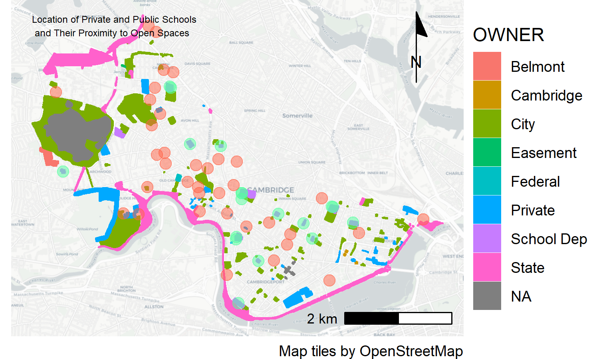
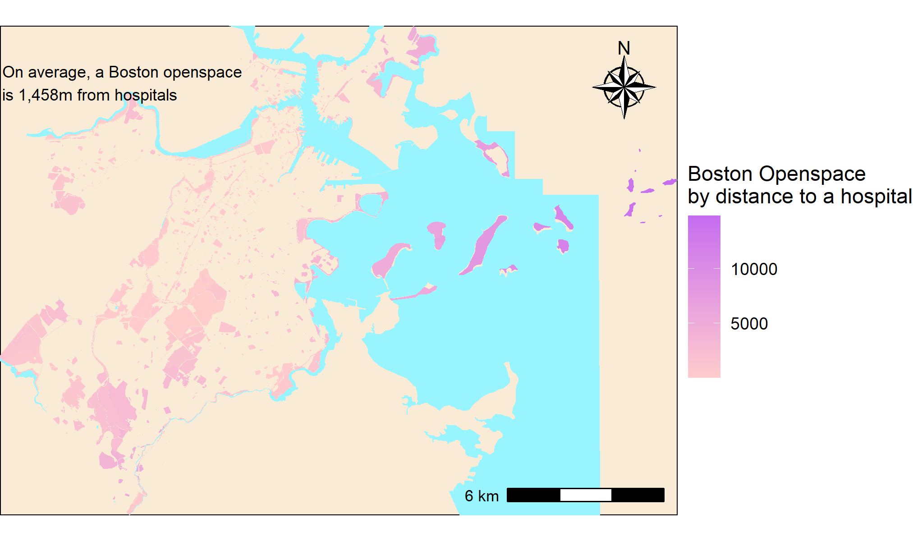
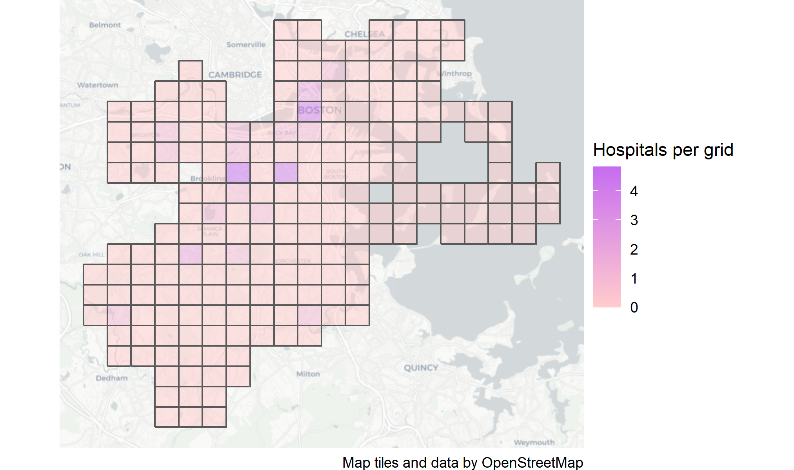
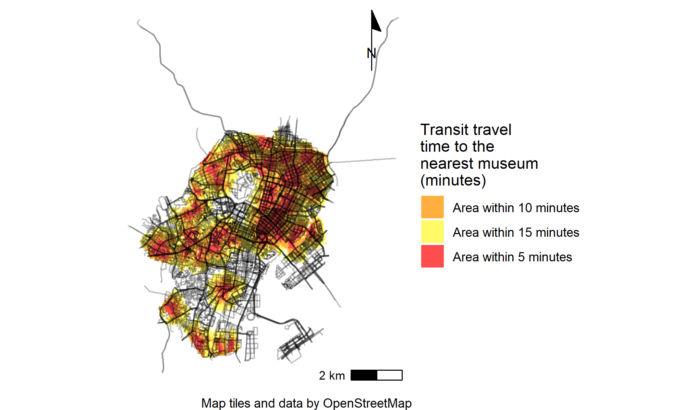
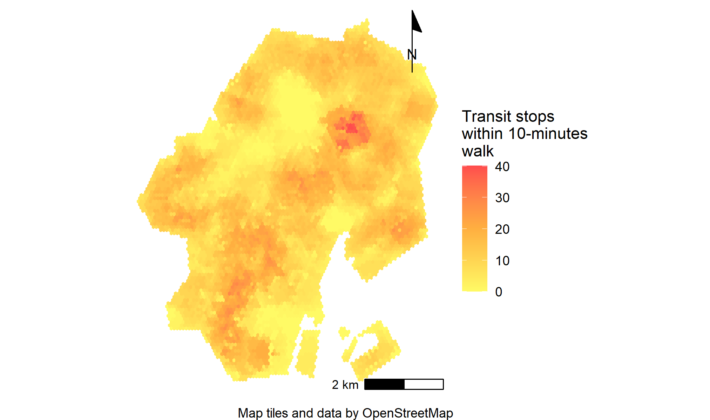
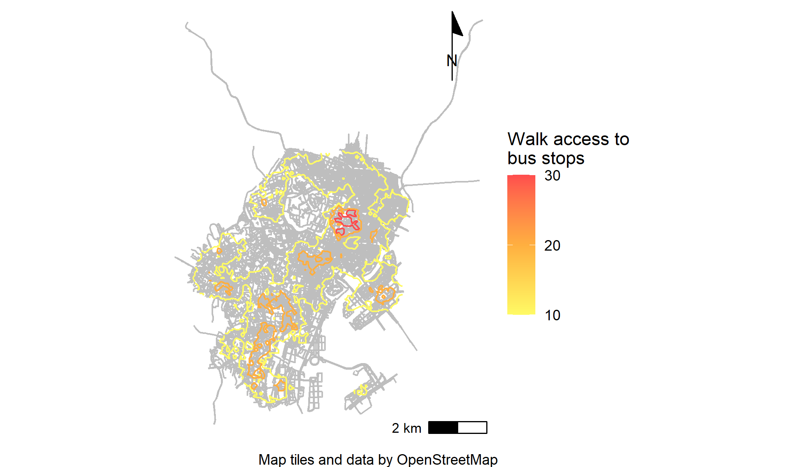
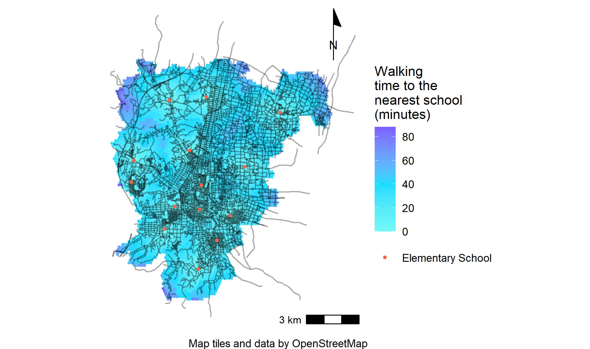

```{r setup, include=FALSE}
knitr::opts_chunk$set(echo = TRUE)
```
# Introduction
This is a portfolio made by Yoji Toriumi, a Master in Urban Planning student at Harvard University Graduate School of Design. Maps on this website are the products of VIS 2128 “Spatial Analysis” assignments.

# Cambridge, Massachusetts, USA
## Location of Schools and Open Spaces
This map shows polygon outlines of open spaces and point data that indicates the location of schools throughout Cambridge. Red points show private school and green points show public school. In addition, owner types of open spaces are shown in different colors.

This interactive map demonstrates the following skills:

*	Displaying multiple vector layers on the same map
[](https://yoji-toriumi.github.io/SA_Portfolio/fullsize/Map_1.pdf){target="_blank"}

# Boston, Massachusetts, USA
## Open Spaces by Distance to a Hospital
This map looks at the distance of the open spaces from the closest hospitals. As a result, the average distance of open spaces from the closest hospitals is 1,458m. This is because there are islands that are treated as open spaces and they contribute to the increment of the average distance.

This interactive map demonstrates the following skills:

*	Aggregating point data to a layer of polygons
[](https://yoji-toriumi.github.io/SA_Portfolio/fullsize/Map_2.pdf){target="_blank"}

## Number of Hospitals in Every Grid
This map shows the number of hospitals in every grid. Grids are made to divide Boston into 20 grids vertically and horizontally. The result indicates that, though Boston covers a wide range of areas, hospitals in Boston are located in certain areas.

This interactive map demonstrates the following skills:

*	Calculating and displaying relationships among point and polygon layers based on distance
[](https://yoji-toriumi.github.io/SA_Portfolio/fullsize/Map_3.pdf){target="_blank"}

# Tokyo, Japan
## Isochrones Map of Tokyo Three Districts
This map shows the travel time to the nearest museums in three districts (Chiyoda-ku, Minato-ku, Chuo-ku) in Tokyo. There are many museums in Tokyo and so we can access there within 15min from a wide range of areas. However, there are no museums nearby the imperial palace (top-middle of the map), and so out-of-reach within 15min.

This interactive map demonstrates the following skills:

*	Calculating and displaying accessibility, based on travel time
[](https://yoji-toriumi.github.io/SA_Portfolio/fullsize/Map_4.pdf){target="_blank"}

## Number of Bus Stops within a 10-Minutes Walk Distance (Vector)
This map shows the number of bus stops within a 10-minutes walk distance of Tokyo three districts. There are many bus stations at the central business district in Tokyo (top-right) and so we can access as many as 40 bus stations around there. On the other hand, the number of bus stations around the imperial palace seems scarce.

This interactive map demonstrates the following skills:

*	Calculating and displaying accessibility, based on travel time
[](https://yoji-toriumi.github.io/SA_Portfolio/fullsize/Map_5.pdf){target="_blank"}

## Number of Bus Stops within a 10-Minutes Walk Distance (Raster)
This map is rasterized image of the above map.

This interactive map demonstrates the following skills:

*	Converting between raster layers and vector layers
*	Displaying raster data on a map
[](https://yoji-toriumi.github.io/SA_Portfolio/fullsize/Map_6.pdf){target="_blank"}

## Number of Bus Stops within a 10-Minutes Walk Distance (Contour Map)
This map is again vectorized from a raster image. 

This interactive map demonstrates the following skills:

*	Converting between raster layers and vector layers
[](https://yoji-toriumi.github.io/SA_Portfolio/fullsize/Map_7.pdf){target="_blank"}

# Mobara City, Chiba, Japan
## Vehicle Coverage in Mobara City
This map shows the car access from my home in Mobara city, where I was born. Many of the areas are within 15-minute's reach from my home.

This interactive map demonstrates the following skills:

*	Calculating and displaying accessibility, based on travel time
[](https://yoji-toriumi.github.io/SA_Portfolio/fullsize/Map_8.pdf){target="_blank"}

## Walking Time to the Nearest School in Mobara City (Vector)
This map shows walking distance from all of the elementary schools in Mobara city. It indicates many of the areas are under the coverage of 30 to 40 minutes distance. However, it takes more than 40 minutes from certain areas, and it is hard for elementary students to walk every day.

This interactive map demonstrates the following skills:

*	Calculating and displaying accessibility, based on travel time
[](https://yoji-toriumi.github.io/SA_Portfolio/fullsize/Map_9.pdf){target="_blank"}

## Walking Time to the Nearest School in Mobara City (Polygon Vector)
This map is created from a rasterized image of the above map by generating polygons from each grid cell.

This interactive map demonstrates the following skills:

*	Converting between raster layers and vector layer
[](https://yoji-toriumi.github.io/SA_Portfolio/fullsize/Map_10.pdf){target="_blank"}

## Walking Time to the Nearest School in Mobara City (Contour)
This is also vectorized map from a raster image.

This interactive map demonstrates the following skills:

*	Converting between raster layers and vector layer
[](https://yoji-toriumi.github.io/SA_Portfolio/fullsize/Map_11.pdf){target="_blank"}

# Orange County, Florida, USA
## Block-wise interactive map in Orange County, Florida
This map shows block-wise percent of the population identifying as Asian alone in Orange County, Florida. Asian tends to live in the periphery of the county as is evidenced by the small percentage of Asian alone in Orlando City area. If you hover over the feature, you can get the information of the total population and the percent of Asian alone.

This interactive map demonstrates the following skills:

*	Displaying data on an interactive map
[](https://yoji-toriumi.github.io/SA_Portfolio/fullsize/Asian_map.html){target="_blank"}

## Tract-wise interactive map in Orange County, Florida
This map shows the tract-wise mean income in Orange County, Florida. The income in Orlando city and south-west area seem higher than the other parts of the county. I also put the location of parks, and it is observed that more parks are located at the center and western part of the county. If you hover over the feature, you can get the information of the income and name of parks.

This interactive map demonstrates the following skills:

*	Displaying data on an interactive map
[](https://yoji-toriumi.github.io/SA_Portfolio/fullsize/orange_park.html){target="_blank"}

# Seoul, Korea
## Old Map Overlayed with Road Data in 2021
This map overlays road data on the base map in 1946. We can observe that almost all of the roads in 1946 still exist in 2021 and so the basic city structure in the urban center has not changed since then. However, many parts of the vacant spaces in 1946 have been developed since then and the city has been transforming drastically.

This interactive map demonstrates the following skills:

*	Georeferencing a raster image
[](https://yoji-toriumi.github.io/SA_Portfolio/fullsize/Seoul.pdf){target="_blank"}